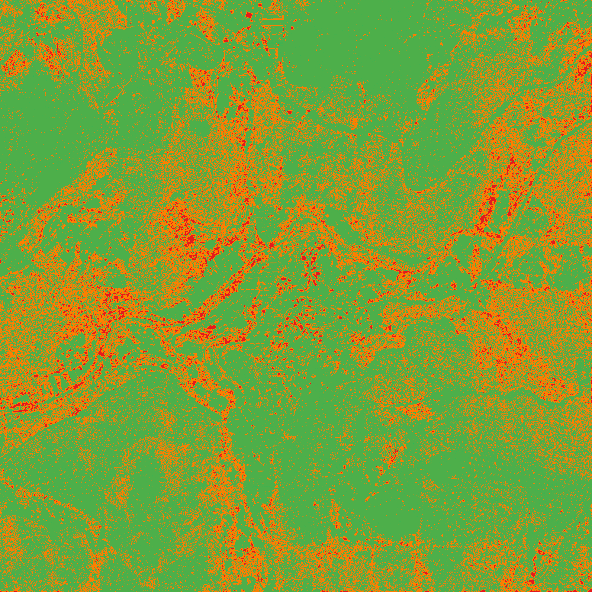

# microrelief

[](https://github.com/joaomanuelsrodrigues/lidar-microrelief/actions/workflows/ci.yml)


microrelief builds a DTM, DSM and CHM from raw airborne LiDAR and publishes a fourth band that
says, for every cell, whether its elevation was measured, interpolated from a neighbour, or left
undetermined. A provenance record travels with the rasters, naming the inputs, the parameters and
the known limitations.



*The basis band over the terraces of Sistelo, Portugal: green measured, orange interpolated, red
undetermined. Drag the comparison yourself in the
[live viewer](https://joaomanuelsrodrigues.github.io/lidar-microrelief/viewer/).*

Each surface band is transparent exactly where it has nothing it can honestly publish: the DTM
where no measured ground lies in the cell or within 2 m of it, the CHM wherever the cell's own
ground was not measured, the DSM only where no return landed at all. The basis band is never
transparent, because a band whose job is to say "we looked and there was nothing to measure" would
erase its own admission by declaring that cell NoData.

## Try it

A 150 m by 150 m sample of DGT LiDAR ships in the repository (`examples/sistelo-sample/`,
CC BY 4.0):

```
git clone https://github.com/joaomanuelsrodrigues/lidar-microrelief
cd lidar-microrelief
uv sync
uv run microrelief run --aoi examples/sistelo-sample/aoi.geojson --laz examples/sistelo-sample \
    --out outputs/sample --attribution "$(cat examples/sistelo-sample/attribution.txt)"
```

You get six GeoTIFFs (`mdt`, `mds`, `chm`, `basis`, `n_all`, `n_ground_asprs`) and
`provenance.json`. On the author's machine the record's hash is `2da06987808e` and the basis is
51.6% measured, 42.3% interpolated, 6.1% undetermined; `tests/test_sample.py` reproduces that
record on every CI run. Open the rasters in QGIS with the styles in `styles/`, following
[`docs/recipes.md`](docs/recipes.md).

## Install

Python 3.12 or newer. Not on PyPI yet. In the clone above, `uv sync --extra dgt`; without a clone:

```
pip install "microrelief[dgt] @ git+https://github.com/joaomanuelsrodrigues/lidar-microrelief"
```

The `dgt` extra adds the one network dependency, `requests`, used by `select` and `precheck` to
read the DGT catalogue. Plain `uv sync` is enough if you bring your own LAZ, since `run` touches no
network. If the `microrelief` console script is not on your `PATH`, `python -m microrelief` takes
the same arguments, and the test suite exercises both forms.

## Your own data

`run` reads every `.laz` directly inside `--laz`, not `.las` and not subdirectories, and refuses
any input it would otherwise have to guess at: a header without a projected metre-axis CRS matching
the area, a coordinate that decodes to NaN, an area declaring no CRS of its own, a `--cell` that
does not divide the 1 m analysis cell, a missing `--attribution`. Every refusal and its reason is
in [`docs/inputs.md`](docs/inputs.md), with what has and has not been exercised. DGT is the one
provider this has been run against; any other is untested rather than unsupported, and site
independence is enforced negatively, by removing `aoi/aoi.geojson` from the tree and requiring
everything outside `tests/case_study/` to pass.

## Results

Four raw DGT LAZ tiles over Sistelo, Arcos de Valdevez, Portugal, 845,372,695 bytes from a single
sortie. DGT's own published rasters are not an input; nothing in this repository reads them. The
commands and their verbatim output are in [`docs/live-smoke.md`](docs/live-smoke.md), and the
machine-readable record is [`docs/viewer/provenance.json`](docs/viewer/provenance.json). How the
tiles were obtained, and why acceptance was a byte-for-byte size check rather than a status code,
is in [`SITE.md`](SITE.md).

```
microrelief select   --aoi aoi/aoi.geojson --out outputs/selection.json
microrelief precheck --aoi aoi/aoi.geojson --cell 0.5 --ground-fraction 0.4
microrelief run      --aoi aoi/aoi.geojson --laz ~/data/dgt-laz-sistelo --out outputs/ \
                     --cell 0.5 --selection outputs/selection.json --attribution "Source: ..."
```

| | |
|---|---|
| Grid | 3960 by 3960 cells of 0.5 m (3.9204 km2), EPSG:3763, one common grid for everything |
| Cell basis | measured 69.7%, interpolated 28.2%, undetermined 2.1% |
| Closed-form void expectation | 0.117% of cells empty, at the measured 27.0 pts/m2 with every return reaching the ground |
| Agreement with the official classification | ground recall 0.993, non-ground recall 0.588, accuracy 0.792, majority-class null 0.503 |
| Reproducibility hash | `09b79da9fff731caeebbb4b37b8c5508eb10ed0399940382212c48ba810518c2` |
| Cost | 34.6 s wall clock, 4.4 GiB peak resident |

Read that void expectation beside the 28.2% interpolated plus the 2.1% undetermined: the gap
between the two is canopy interception and the filter's own rejections together, since a cell
counts as measured only when the filter calls it ground.

Ground is decided by this package's own implementation of the Simple Morphological Filter (Pingel
et al., 2013), written from PDAL 2.10.2's source and agreeing with that build on 99.662% of cells
at a kappa of 0.991 over a six-tile test area. The official ASPRS classification is the reference
the run is quantified against, never an input to the filter. How that filter was chosen, what it
replaced and how it scores beside PDAL's own two are in
[`docs/ground-filter.md`](docs/ground-filter.md).

The filter is deliberately not the product. It is re-derived from the raw returns so that every
published cell has a traceable origin, and the claim is the basis band and the record rather than
the surface. That is why the filter could be swapped without the product changing shape.

## What this does not support

- The ground filter does not remove every building, and the record calls what it keeps measured. At
  a built site near Valongo, 16.4% of the cells holding official building returns and no ground
  return publish as measured; the filter this tool ran until 0.5.0 published 87.7% of them
  ([diagnosis](docs/ground-filter-diagnosis.md)). It surfaced only on a second area chosen for what
  it contains rather than for what it shows ([gate result](docs/second-aoi-gate-result.md)), after
  272 tests, a ten-round review and a security pass had all gone over the code. Every one of those
  asks about the code, and none asks what the input holds.
- Terrace preservation is measured, not enforced. The filter it replaced guaranteed survival by
  construction, through a parameter this one does not have, so that risers survive is now an
  empirical result at one site: it keeps 91.078% of the cells the previous
  filter called measured ground, and 95.082% of those standing on a step above 2.5 m
  ([result](docs/p4-terrace-result.md)). "Standing on a step" is a range in a 3.5 m window, which
  cannot tell a riser from a slope steep enough to span it: 42.4% of the cells passing that test sit
  within 0.30 m of a plane ([result](docs/sharp-step-result.md)). Adding a planarity term to the
  95.082%'s own population leaves it at 94.2%.
- Byte-identical replay on real data is not established. One run saw a corrupted coordinate and a
  failed read in four reads of the 845 MB dataset, with the source files intact and their sha256
  stable; 192 controlled re-reads across both backends, memory pressure and cold caches reproduced
  neither, and the root cause stays open. `read_laz` refuses any return outside its tile's declared
  box, which turns a silent corruption into a loud failure without making replay stable.
- Cross-machine replay is unverified. Byte-identity holds on this machine's clean reads and on the
  synthetic goldens; no second machine has reproduced the run.
- The reproducibility hash sees code only through the package version, and that bump is enforced
  only by a warn-class CI check, which declares its own blindness and over-reach in its header.
- The hash does not cover the attribution string either. Two runs differing only in
  `--attribution` share a hash, so a product can be relabelled with a different source and keep its
  anchor.
- The published grid overhangs the area you ask for. Snapping to whole 1 m analysis blocks can add
  up to `(1 m / --cell) - 1` cells per axis, and membership is decided against the grid rather than
  the polygon, so a cell added there publishes what was measured in it rather than undetermined.
- The ground-fraction term of the void expectation is a reference model, not a measurement. It is
  the null the measured void share is read against, and tuning it to match would destroy the
  comparison.
- Ground is decided per cell, not per return. `n_ground_asprs` is the official per-cell count, not
  ours.
- Interpolated cells borrow the nearest measured value, never farther than 2 m, with no smoothing.
  The borrowed-from cell indices exist only inside the run and are not among the six published
  bands.
- The area is a single sortie, so `mixed_epochs` is false. One mixing flight dates would be a mosaic
  of moments; the pipeline refuses it unless told to accept it, and the record declares it.
- Calling `select_tiles` as a library function bypasses the CRS check between area and tile, which
  lives at the CLI's composition root. No caller does today; the gap becomes reachable exactly when
  someone uses this as a library.
- `scripts/measure_risers.py` takes no `--crs`, so it can only work an area that declares its own
  projected CRS. It is a measurement script, not part of the package's interface.
- The only resource ceiling is a cell count, not a memory bound. 200,000,000 cells at a measured
  60 B/cell is around 12 GB before the ground filter, the two distance transforms and the surfaces,
  so a grid inside the ceiling can still be OOM-killed: a failure without a reason, which is the
  opposite of everything else here.

## Prior art

A per-cell band saying what an elevation is made of is not new. Copernicus DEM, ArcticDEM and
NASADEM all ship one, and the Copernicus Filling Mask goes further than this by naming the donor
dataset for every filled pixel. What is missing is the tool layer: GDAL, PDAL, GRASS, SAGA and
WhiteboxTools all fill voids without handing back a band saying which cells they just invented. The
quotes, the mapping onto those conventions, and the objections a domain reader will raise are in
[`docs/prior-art.md`](docs/prior-art.md).

## Attribution

Source: Direção-Geral do Território (DGT), Centro de Dados, LiDAR point clouds, licensed
CC BY 4.0. Derived products (ground classification, DTM, DSM, CHM) produced by `microrelief`, not
reviewed or endorsed by DGT. The attribution travels inside every exported GeoTIFF's tags and in
`docs/viewer/provenance.json`, so it reaches whoever holds the file, not only whoever found this
page.
